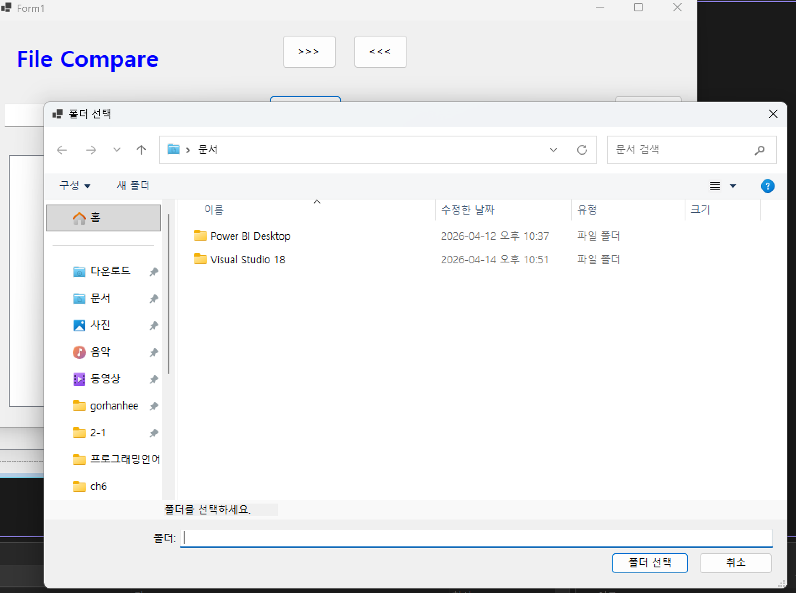
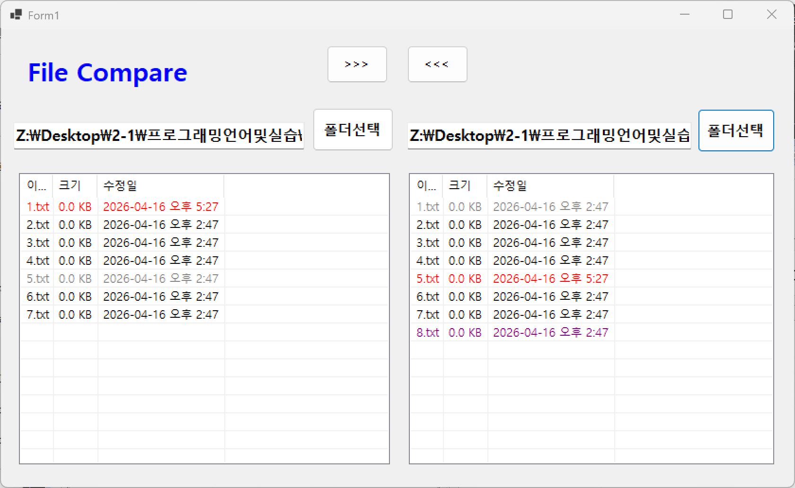
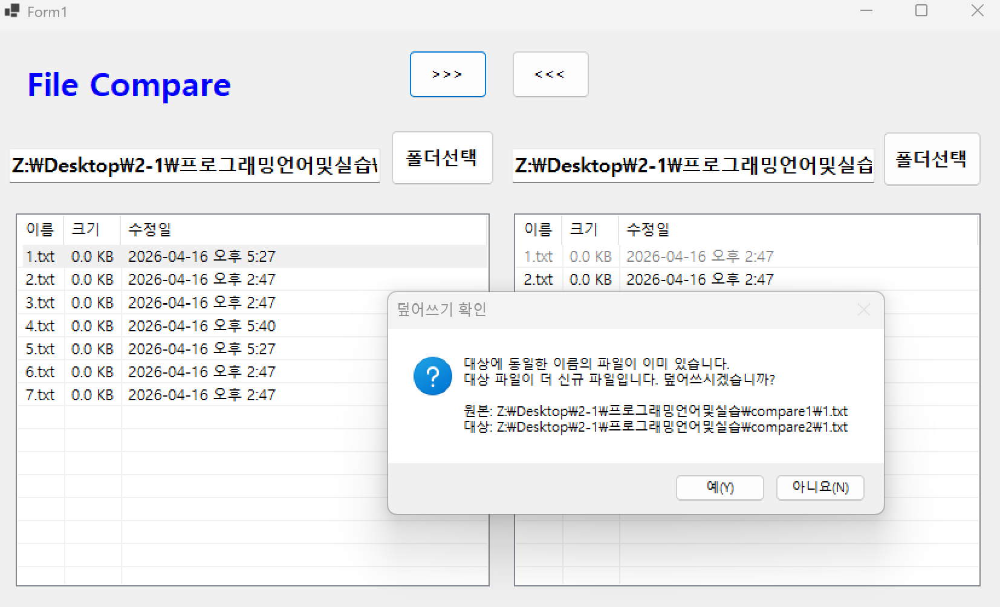
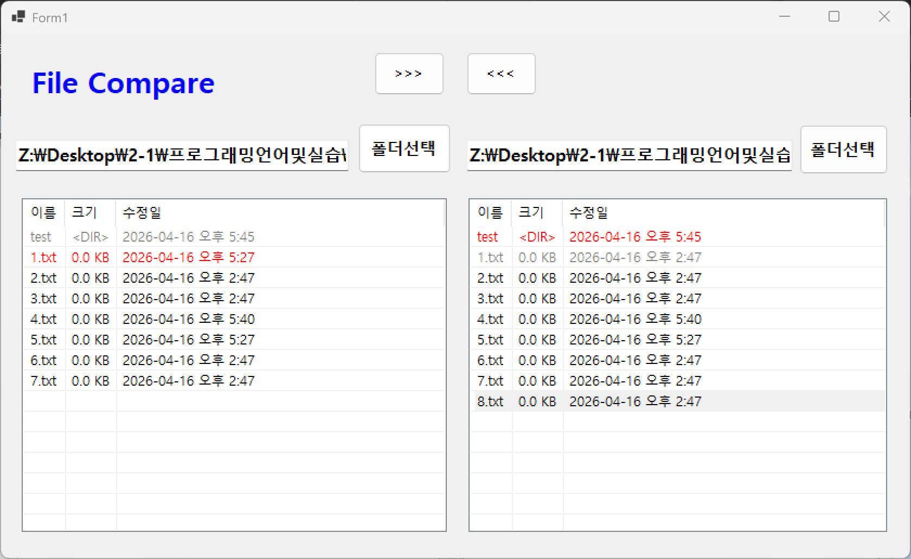

# (C# 코딩) 파일 컴페어

## 개요
- C# 프로그래밍 학습
- 1줄 소개 : 두 개의 폴더를 비교하고 최신 파일을 동기화해주는 파일 비교 프로그램
- 사용한 플랫폼:
    - C#, .NET Windows Forms, Visual Studio, GitHub
- 사용한 컨트롤
    - SplitContainer: 양쪽 폴더의 리스트를 균형 있게 배치하기 위한 분할 컨테이너
    - ListView: 파일명, 크기, 수정 날짜 등 파일 정보를 표 형태로 표시
    - FolderBrowserDialog: 사용자로부터 작업할 폴더 경로를 입력받는 다이얼로그
    - Button & TextBox: 경로 표시 및 복사 명령 실행을 위한 컨트롤
- 사용한 기술과 구현한 기능
    - FileSystemInfo & DirectoryInfo: 파일과 하위 폴더의 속성 정보를 일관되게 취득
    - Dictionary (자료구조): 양쪽 폴더의 파일명을 Key로 저장하여 빠른 비교 로직 구현
    - 재귀적 알고리즘(Recursive): 하위 폴더 내부의 모든 파일과 폴더를 통째로 복사하는 기능
    - 날짜 동기화 및 오차 제어: 복사 후 원본 날짜를 이식하고, 1초 미만의 시간 오차를 보정하여 비교 정확도 향상

---

## 실행 화면 (과제1)
- 코드의 실행 스크린샷과 구현 내용 설명

- 구현한 내용 (위 그림 참조)
    - FolderBrowserDialog를 활용하여 사용자가 로컬 디렉토리를 직관적으로 선택하고 경로를 입력받는 기능을 구현했습니다.
    - DirectoryInfo 클래스를 사용하여 선택된 경로 내의 모든 파일과 디렉토리 정보를 수집하고 ListView 컨트롤에 바인딩했습니다.
    - ListView의 View 속성을 Details 모드로 설정하고 컬럼을 생성하여 이름, 용량, 수정 시간을 표 형태로 출력했습니다.
    - 파일의 byte 단위를 KB 단위로 계산하고 소수점 첫째 자리까지 표시하는 포맷팅 함수를 적용했습니다.
    - 항목의 타입을 체크하여 폴더인 경우 용량 열에 DIR 문자열을 출력함으로써 파일과 시각적으로 구분되도록 했습니다.

## 실행 화면 (과제2)
- 코드의 실행 스크린샷과 구현 내용 설명

- 구현한 내용 (위 그림 참조)
    - Dictionary 자료구조를 활용하여 양쪽 폴더의 파일 목록을 파일명 기준으로 저장함으로써 데이터 비교 성능을 최적화했습니다.
    - 양쪽 폴더를 교차 비교하여 파일의 존재 여부와 수정 시간을 바탕으로 총 4가지의 파일 상태를 정의했습니다.
    - 수정 시간이 완벽히 일치하는 파일은 검정색으로 표시하여 동기화 상태임을 나타냈습니다.
    - 기준 폴더의 파일이 더 최신인 경우 빨간색, 더 오래된 경우 회색으로 표시하여 시간 차이를 직관적으로 구분했습니다.
    - 한쪽 폴더에만 존재하는 단독 파일이나 폴더는 보라색으로 설정하여 추가 혹은 삭제가 필요한 항목임을 강조했습니다.

## 실행 화면 (과제3)
- 코드의 실행 스크린샷과 구현 내용 설명

- 구현한 내용 (위 그림 참조)
    - ListView에서 선택된 아이템의 파일명을 추출하고 Path.Combine을 사용하여 대상 폴더로의 절대 경로를 생성하는 복사 로직을 구현했습니다.
    - File.Exists 기능을 통해 복사하려는 위치에 동일한 이름의 파일이 이미 존재하는지 사전에 확인합니다.
    - 사용자 실수로 최신 파일이 구형 파일로 덮어씌워지는 것을 방지하기 위해 대상 파일이 더 신규인 경우에만 경고 메시지 창을 출력합니다.
    - 메시지 박스 내부에 원본 파일과 대상 파일의 전체 경로를 포함시켜 사용자가 복사 과정을 명확히 인지하도록 설계했습니다.
    - 복사 완료 후 자동으로 양쪽 데이터를 다시 읽어와 리스트의 색상 상태가 즉시 업데이트되도록 처리했습니다.

## 실행 화면 (과제4)
- 코드의 실행 스크린샷과 구현 내용 설명

- 구현한 내용 (위 그림 참조)
    - 단일 파일뿐만 아니라 폴더 선택 시에도 내부의 모든 하위 구조와 파일들을 통째로 복사하는 재귀 호출 알고리즘을 구현했습니다.
    - 윈도우 운영체제에서 폴더 생성 시 수정 날짜가 생성 시점으로 초기화되는 문제를 해결하기 위해 복사 완료 후 원본 날짜를 대상 폴더에 강제로 동기화했습니다.
    - 파일 시스템 간의 미세한 시간 기록 오차를 해결하기 위해 두 파일의 시간 차이가 1초 이내라면 동일한 파일로 간주하는 오차 보정 로직을 적용했습니다.
    - FileSystemInfo 부모 클래스를 활용하여 파일과 디렉토리를 하나의 리스트에서 통합적으로 관리하고 비교할 수 있도록 개선했습니다.
    - 복사 작업 성공 시 도착지 폴더의 딕셔너리 정보만 부분적으로 갱신하여 프로그램의 응답성을 높였습니다.